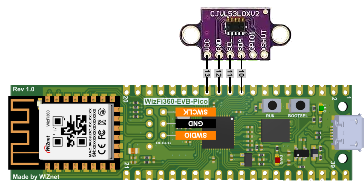

# Oh No! No More Toilet Paper!

IoT device capable of detecting if there is toilet paper left on the dispenser or not.

Uses a WIZnet WizFi360-EVB-Pico board + a VL53L0X Time-of-Flight (ToF) sensor.

WizFi360 provides Wi-Fi connectivity and MQTT and cloud support. The ToF sensor measures the thickness of the layer of paper rolled on the tube. The measured thickness, actually a distance in millimeters, is sent to an IoT dashboard using the MQTT protocol. The dashboard can be anything, I used Home Assistant.

The software is an Arduino sketch for the RP2040. I used Arduino IDE 1.8.19.
Required external libraries:
- Raspberry Pi Pico/RP2040 boards package v2.6.0 by Earle F. Philhower, III
- DFRobot_VL53L0X library v1.0.0 by DFRobot

Board to select in the IDE: WIZnet WizFi360-EVB-Pico

Entry for WizFi360 Design Contest 2022
